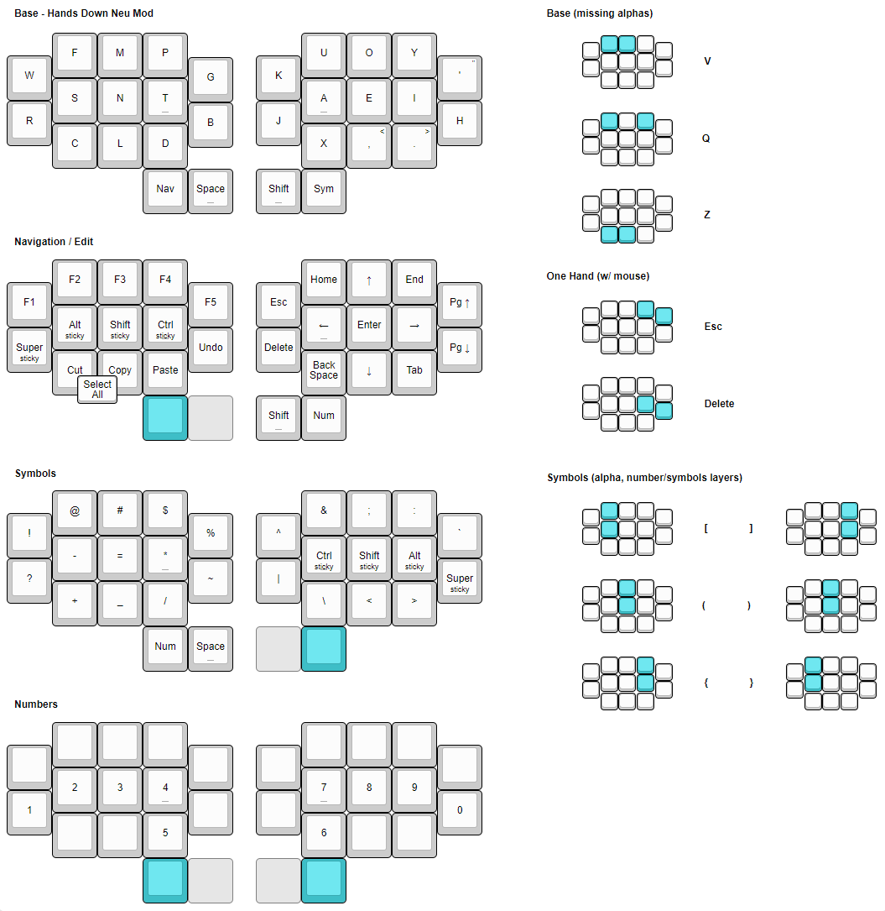
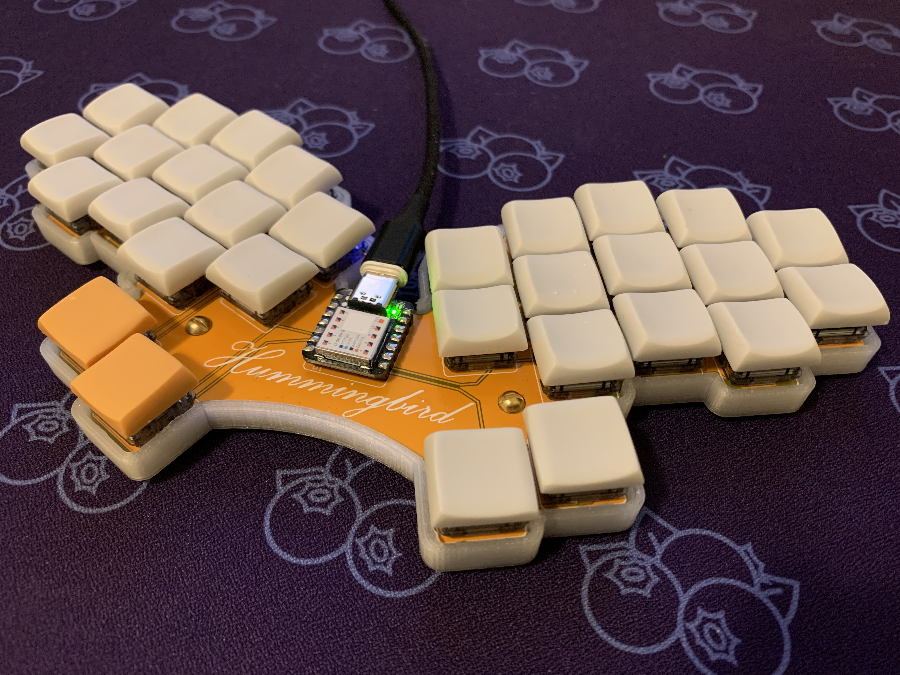
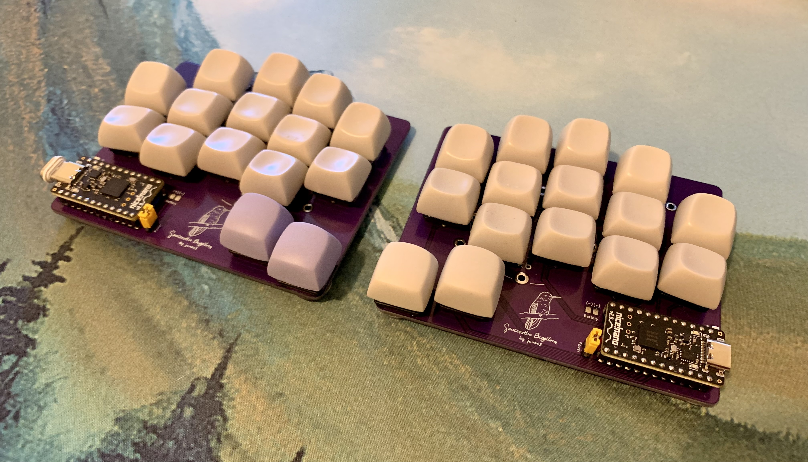
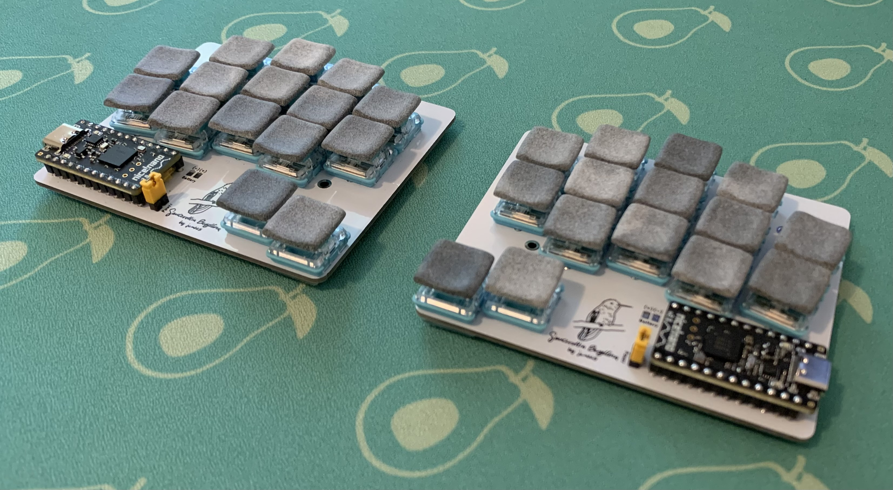
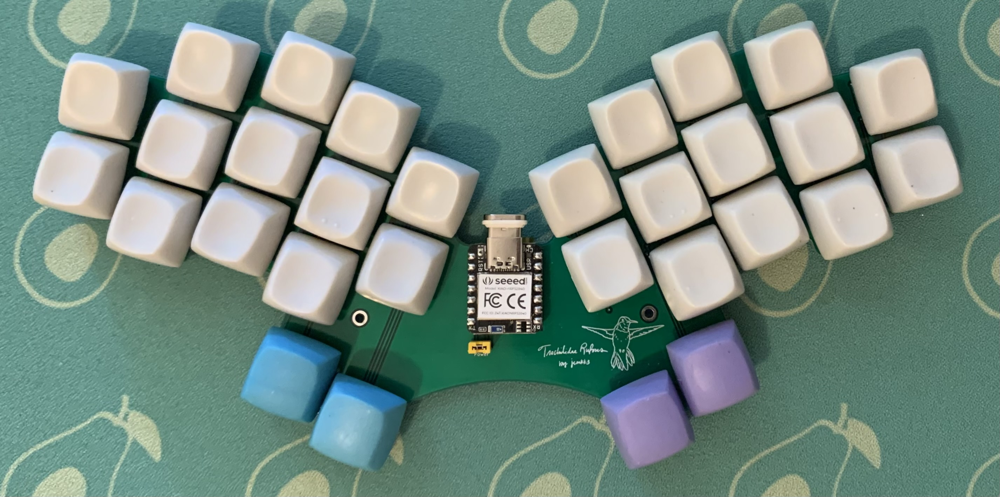
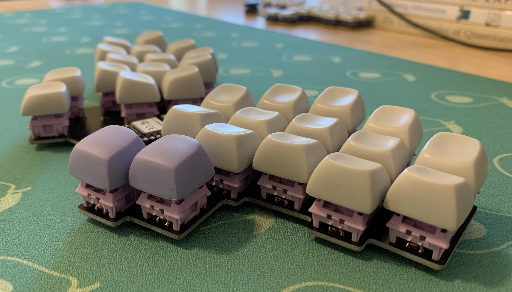
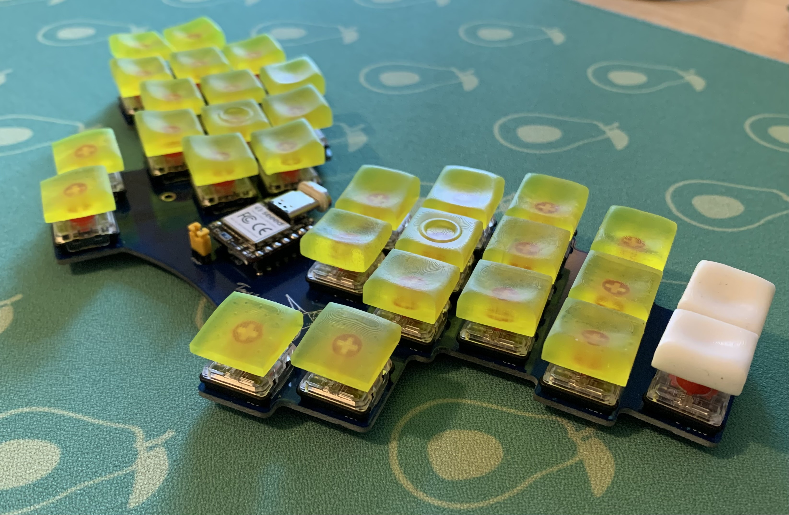
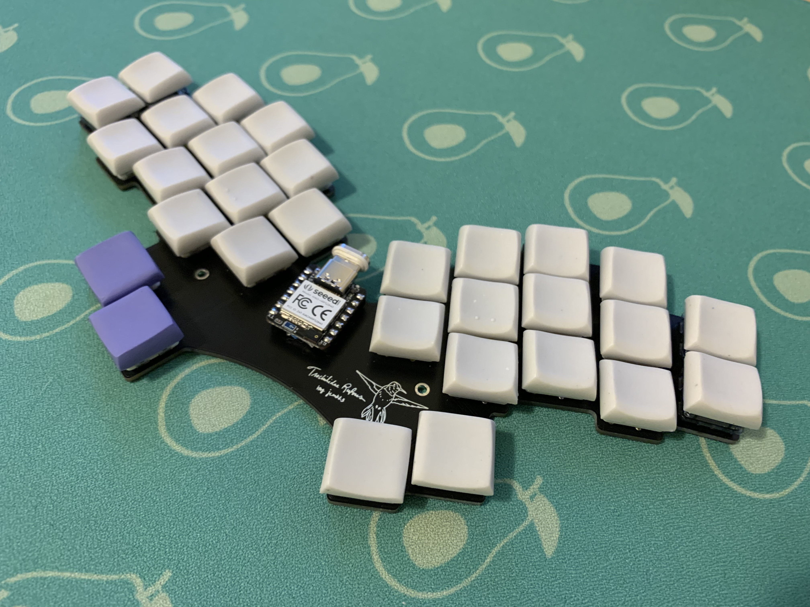

# Config for my ZMK powered Keyboards

This repo contains the config for my keyboard's firmware and builds it!

## Keymap
 

## Keyboards
Here are my keyboards that this firmware powers.

**[Hummingbird](https://github.com/PJE66/hummingbird)**

**[Berylline](https://github.com/jcmkk3/trochilidae/releases/tag/berylline_v0.1)**

Choc

Choc V2 (MX Spaced)

Choc Min Spaced

MX Min Spaced

**[Rufous Variations](https://github.com/jcmkk3/trochilidae/)**

Choc

Choc V2 (MX Spaced)

MX

Choc V2 (Choc Spaced)

Choc Mini/Choc Hybrid

MX Classic

