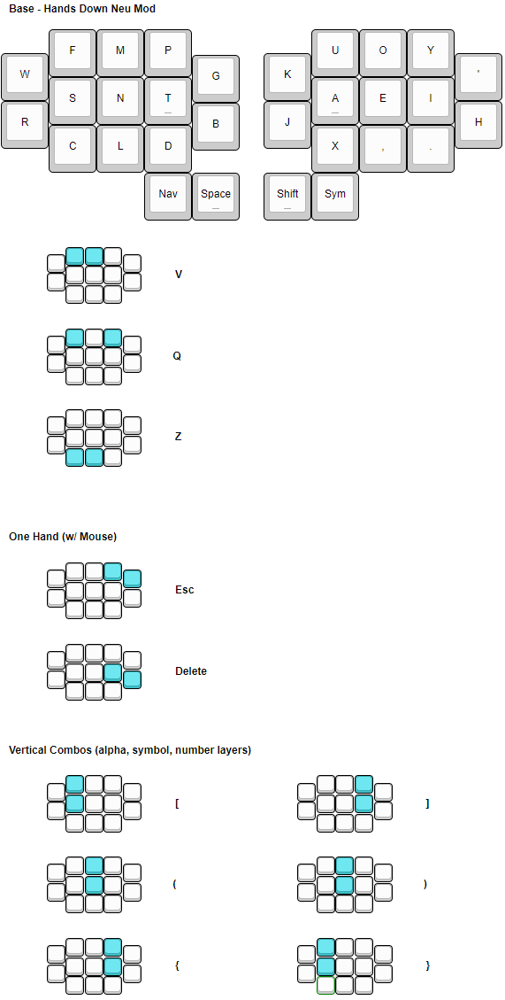
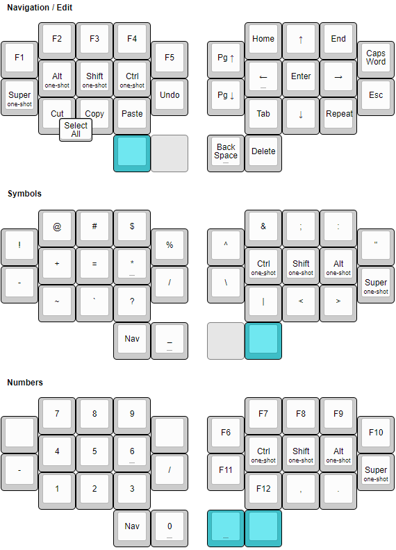

# Config for my ZMK powered Keyboards

This repo contains the config for my keyboard's firmware and builds it!

## Keymap

 

## Keyboards
Here are my keyboards that this firmware powers.

**[Hummingbird](https://github.com/PJE66/hummingbird)**

**[Rufous Splay](https://github.com/jcmkk3/trochilidae/releases/tag/rufous_splay_v0.2)**

**[Rufous MX](https://github.com/jcmkk3/trochilidae/releases/tag/rufous_mx_v0.1)**

**[Berylline](https://github.com/jcmkk3/trochilidae/releases/tag/berylline_v0.1)**

